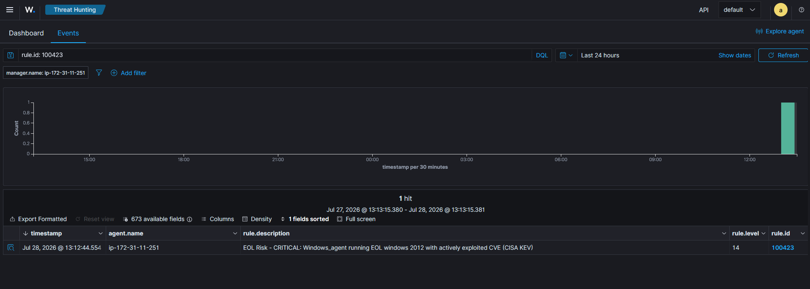
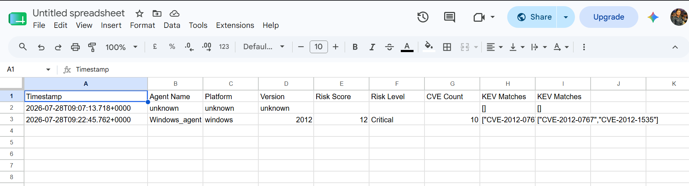

# EOL Risk Detection & Automated Response Pipeline

A threat-intelligence-driven detection engineering project built on **Wazuh SIEM**, deployed on **AWS EC2**, that identifies End-of-Life (EOL) software across an environment, enriches findings with real-time **CVE** and **CISA KEV (Known Exploited Vulnerabilities)** data, and automatically triggers a **SOAR workflow** for critical findings.

This project moves beyond simple EOL detection ("this software is outdated") to **risk-based prioritization** ("this software is outdated AND actively being exploited in the wild") — the same philosophy behind industry frameworks like CISA's SSVC and EPSS.

---

## Problem Statement

Most EOL/vulnerability scanners flag everything as equally urgent, leading to alert fatigue. Security teams end up with hundreds of "critical" findings and no way to determine what to actually fix first. This project solves that by scoring EOL findings based on **real-world exploitability**, not just how outdated the software is.

---

## Architecture

```
┌─────────────────────┐
│  Wazuh Agents        │  (Linux + Windows, AWS EC2)
│  Syscollector module │  → collects OS/software inventory
└──────────┬───────────┘
           │
┌──────────▼───────────┐
│  eol_detector.py      │  → pulls inventory via Wazuh API
│                       │  → checks OS versions against
│                       │    endoflife.date API
└──────────┬───────────┘
           │  eol.json
┌──────────▼───────────┐
│  risk_scorer.py       │  → cross-references findings with:
│                       │      • NVD API (CVE + CVSS data)
│                       │      • CISA KEV feed (actively
│                       │        exploited CVEs)
│                       │  → calculates tiered risk score
└──────────┬───────────┘
           │  eol_risk.json
┌──────────▼───────────┐
│  Wazuh Manager         │
│  Custom decoder + rules│ → generates severity-based alerts
│                       │    (Low / Medium / High / Critical)
└──────────┬───────────┘
           │  Critical alerts only
┌──────────▼───────────┐
│  Wazuh Integration    │  → custom webhook script
│  (custom-eol-webhook) │
└──────────┬───────────┘
           │  HTTPS POST
┌──────────▼───────────┐
│  n8n (SOAR)           │  → receives alert payload
│  Webhook → Google      │
│  Sheets workflow       │
└──────────┬───────────┘
           │
┌──────────▼───────────┐
│  Google Sheets         │  → auto-logged findings for
│  (auto-logged ticket)  │    tracking and reporting
└───────────────────────┘
```

---

## Key Features

- **Automated EOL Detection** — Uses Wazuh Syscollector inventory data + the [endoflife.date](https://endoflife.date) API to flag agents running unsupported OS versions.
- **CVE Enrichment** — Queries the [NVD API](https://nvd.nist.gov) for known vulnerabilities tied to each EOL finding, including CVSS severity.
- **Exploit-Aware Risk Scoring** — Cross-references CVEs against the [CISA Known Exploited Vulnerabilities (KEV)](https://www.cisa.gov/known-exploited-vulnerabilities-catalog) catalog to identify vulnerabilities being actively exploited in the wild — not just theoretically risky ones.
- **Tiered Severity Model** — Findings are scored Low / Medium / High / Critical based on a weighted formula (EOL status + CVE presence + CVSS severity + active exploitation + exposure), reducing alert fatigue.
- **Native Wazuh Integration** — Custom decoder and rules ingest enriched findings directly into the Wazuh dashboard with appropriate severity levels (rule IDs 100420–100423).
- **SOAR Automation** — Critical-severity findings automatically trigger an n8n workflow via Wazuh's native integration framework, logging structured incident data to Google Sheets in real time — no manual triage required.

---

## Tech Stack

| Component | Tool |
|---|---|
| SIEM | Wazuh 4.14.5 (all-in-one, self-hosted) |
| Cloud Infrastructure | AWS EC2 (Wazuh server + Linux & Windows agents) |
| Detection Scripting | Python 3 (`requests`) |
| Threat Intelligence Sources | NVD API, CISA KEV Feed, endoflife.date API |
| SOAR / Automation | n8n (cloud) |
| Alert Sink | Google Sheets |

---

## Risk Scoring Logic

| Factor | Score Weight |
|---|---|
| Base (software is EOL) | +1 |
| Known CVEs exist for the version | +3 |
| Highest CVSS score ≥ 7 (High/Critical) | +3 |
| CVE listed in CISA KEV (actively exploited) | +5 |
| Asset is internet-facing | +3 |

| Total Score | Risk Level |
|---|---|
| 0–3 | Low |
| 4–5 | Medium |
| 6–8 | High |
| 9+ | Critical |

This ensures that **not all EOL software is treated as equally urgent** — only findings with real-world exploit evidence are escalated to Critical, aligning with how enterprise vulnerability management actually prioritizes remediation.

---

## Example: End-to-End Detection

**Finding:** Windows Server 2012 (EOL since 2023-10-10) detected on an agent.

**Enrichment result:**
- 10 related CVEs found via NVD
- Max CVSS score: 10.0
- 2 CVEs matched in the CISA KEV catalog (`CVE-2012-0767`, `CVE-2012-1535`)
- **Risk Score: 12 → Critical**

**Resulting Wazuh Alert (Rule 100423, Level 14):**
> `EOL Risk - CRITICAL: Windows_agent running EOL windows 2012 with actively exploited CVE (CISA KEV)`

**Automated response:** Alert triggers Wazuh's integration module, which sends a webhook to n8n, which appends a structured row to a Google Sheet — creating an auditable, real-time record without analyst intervention.

---

## Screenshots

**Wazuh Dashboard — Critical EOL Risk Alert**
Custom rule (100423, Level 14) firing for an EOL Windows Server 2012 asset with 2 CVEs matched against the CISA KEV catalog.



**Google Sheets — Auto-Logged Finding via SOAR Workflow**
Critical finding automatically appended to a Google Sheet in real time via the Wazuh → n8n webhook integration, including CVE count and matched KEV IDs — no manual intervention.



---

## Repository Structure

```
eol-detector/
├── eol_detector.py        # Pulls agent OS inventory, checks against endoflife.date
├── risk_scorer.py         # Enriches EOL findings with CVE + KEV data, calculates risk score
├── asset_tags.json         # Manual exposure/criticality tagging per agent
└── wazuh_config/
    ├── local_decoder.xml   # Custom JSON decoder reference
    ├── local_rules.xml     # Custom rules (100420–100423) for tiered alerting
    └── integrations/
        ├── custom-eol-webhook      # Wazuh integration wrapper script
        └── custom-eol-webhook.py   # Sends enriched alert data to n8n webhook
```

---

## MITRE ATT&CK Mapping

EOL and unpatched software is a common enabler of:
- **T1190 – Exploitation of Public-Facing Application** (Initial Access)
- **T1210 – Exploitation of Remote Services** (Lateral Movement)

Flagging EOL assets with active exploit evidence directly supports proactive defense against these techniques.

---

## Lessons Learned / Troubleshooting Notes

This project involved real debugging that mirrors production detection engineering work:
- Diagnosed a **decoder mismatch** where `log_format: json` in Wazuh silently overrides custom decoders in favor of the built-in JSON decoder — rules had to reference `json` instead of the custom decoder name.
- Identified that **Wazuh integration scripts fail silently on incorrect file permissions** (`wpopenv()` rejects group-writable integration scripts) — resolved by setting `550` instead of `750`.
- Found a **draft vs. published state gap in n8n**, where an edited node config (Append vs. Append-or-Update operation) wasn't reflected in the live webhook until explicitly published — a reminder that "saved" and "live" aren't always the same thing in workflow automation tools.

---

## Future Enhancements

- [ ] Extend detection beyond OS-level EOL to individual software packages (e.g. web servers, databases)
- [ ] Add asset criticality/internet-facing tagging via a real CMDB instead of manual JSON
- [ ] Schedule `eol_detector.py` and `risk_scorer.py` via cron for continuous monitoring
- [ ] Add exception/risk-acceptance handling for intentionally-retained legacy systems
- [ ] Extend SOAR workflow with auto-ticketing (Jira) and Slack/Teams notifications for Critical findings

---

## Author

**Muhammad Ali**
Junior SOC Engineer | Detection Engineering & AI-Assisted SOC Enthusiast

